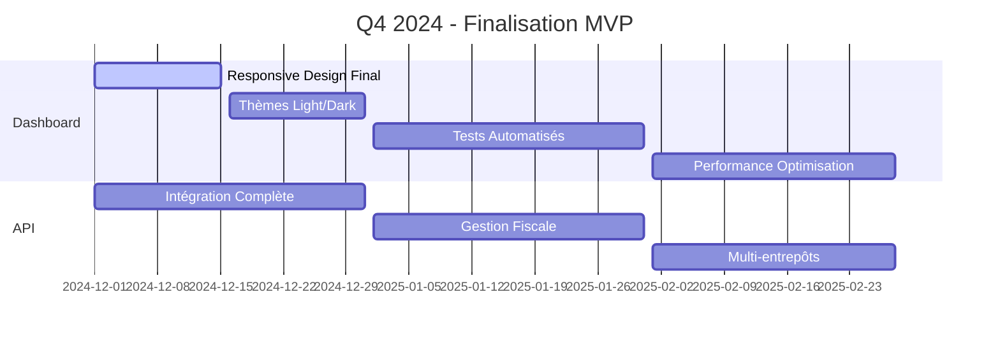

# 🚀 MANIFESTE ÉQUITECH - Guide de Développement

> **Document de référence pour l'équipe de développement Equitech**  
> *Version 1.0 - Dernière mise à jour : 22 Aout 2024*  
> *[Historique des changements](#historique-des-changements)*

---

## 📋 **Table des Matières**

1. [🎯 Vision & Objectifs](#-vision--objectifs)
2. [🏗️ Architecture Globale](#️-architecture-globale)
3. [💻 Standards de Développement](#-standards-de-développement)
4. [🔄 Workflow de Développement](#-workflow-de-développement)
5. [📊 État Actuel & Roadmap](#-état-actuel--roadmap)
6. [🛠️ Guide Pratique](#️-guide-pratique)
7. [📚 Ressources & Documentation](#-ressources--documentation)

---

## 🎯 **Vision & Objectifs**

### **Mission**
Créer une **suite d'outils ERP modernes** pour les TPE/PME, centrée sur l'**expérience utilisateur** et la **scalabilité**, en respectant les **bonnes pratiques** et en favorisant un **environnement de travail épanouissant**.

### **Valeurs Fondamentales**
- **🎨 UX First** : L'expérience utilisateur prime sur tout
- **🔧 Code Quality** : Maintenabilité et lisibilité avant tout
- **🚀 Scalability** : Architecture évolutive et performante
- **🤝 Collaboration** : Travail d'équipe et partage de connaissances
- **📈 Innovation** : Amélioration continue et adoption des nouvelles technologies

### **Périmètre Global**

#### **🏢 Produits Actuels**
- **Dashboard Admin** : Interface d'administration ERP (Next.js 15)
- **API Symfony** : Backend robuste et sécurisé
- **UI Library** : Composants réutilisables (@equitech-dev/ui-library)

---

## 🏗️ **Architecture Globale**

### **Stack Technique Unifiée**

#### **Frontend**
```typescript
// Framework Principal
Next.js 15 (App Router) + TypeScript

// Styling
SCSS + CSS Modules + Atomic Design
// OU Tailwind CSS (décision en cours)

// État & Gestion
React Context + Hooks personnalisés
// Futur : Zustand ou Redux Toolkit

// Composants
Design System personnalisé
Material-UI (composants de base)
```

#### **Backend**
```typescript
// Framework Principal
Symfony 6+ + PHP 8.2+

// Base de Données
PostgreSQL (production)
SQLite (développement)

// Authentification
JWT + Refresh Tokens
OAuth2 (futur)

// API
REST API + OpenAPI/Swagger
GraphQL (futur)
```

#### **Infrastructure**
```yaml
# Déploiement
Vercel (Frontend)
Railway/Heroku (Backend)

# CI/CD
GitHub Actions + SonarQube
Tests automatisés + Quality Gates

# Monitoring
Sentry (erreurs)
Vercel Analytics (performance)
```

### **Patterns Architecturaux**

#### **Frontend - Architecture Modulaire**
```
src/
├── app/                    # Pages Next.js (App Router)
│   ├── (auth)/            # Routes d'authentification
│   ├── (admin)/           # Routes protégées admin
│   ├── (modules)/         # Modules ERP
│   └── api/               # API Routes Next.js
├── components/            # Composants réutilisables
│   ├── ui/               # Composants UI de base
│   ├── modules/          # Composants spécifiques modules
│   └── widgets/          # Système de widgets
├── services/             # Services métier
├── hooks/                # Hooks React personnalisés
├── types/                # Types TypeScript
└── styles/               # Styles globaux
```

#### **Backend - Architecture Hexagonale**
```
src/
├── Controller/           # Contrôleurs API
├── Service/             # Logique métier
├── Repository/          # Accès aux données
├── Entity/              # Modèles de données
├── DTO/                 # Data Transfer Objects
├── Event/               # Événements métier
└── Infrastructure/      # Services externes
```

### **Standards de Sécurité**
- **🔐 Authentification** : JWT avec refresh tokens
- **🛡️ Autorisation** : RBAC (Role-Based Access Control)
- **🔒 Validation** : Validation côté client ET serveur
- **📝 Audit** : Logs de toutes les actions sensibles
- **🌐 CORS** : Configuration stricte des origines

---

## 💻 **Standards de Développement**

### **Conventions de Code**

#### **TypeScript**
```typescript
// ✅ BON - Interfaces claires et typées
interface User {
  id: string;
  email: string;
  role: UserRole;
  companyId: string;
  isActive: boolean;
  createdAt: Date;
}

// ✅ BON - Types union pour les états
type OrderStatus = 'pending' | 'processing' | 'completed' | 'cancelled';

// ✅ BON - Enums pour les constantes
enum UserRole {
  ADMIN = 'ROLE_ADMIN',
  MANAGER = 'ROLE_MANAGER',
  USER = 'ROLE_USER'
}
```

#### **React Components**
```typescript
// ✅ BON - Composants fonctionnels avec TypeScript
interface WidgetProps {
  data: WidgetData;
  config?: WidgetConfig;
  onAction?: (action: string) => void;
}

const MetricWidget: React.FC<WidgetProps> = ({ 
  data, 
  config, 
  onAction 
}) => {
  // Logique du composant
  return (
    <div className="metric-widget">
      {/* JSX */}
    </div>
  );
};
```

#### **Services**
```typescript
// ✅ BON - Services avec gestion d'erreur
class ProductService {
  async getProducts(): Promise<Product[]> {
    try {
      const response = await fetch('/api/V1/products');
      if (!response.ok) {
        throw new Error(`HTTP ${response.status}`);
      }
      return await response.json();
    } catch (error) {
      console.error('Erreur lors de la récupération des produits:', error);
      return MOCK_DATA.products; // Fallback
    }
  }
}
```

### **Conventions de Nommage**

#### **Fichiers & Dossiers**
```
✅ BON                    ❌ MAUVAIS
components/              Components/
user-profile/            userProfile/
ProductList.tsx          productList.tsx
useWidgetData.ts         useWidgetData.js
```

#### **Variables & Fonctions**
```typescript
// ✅ BON - camelCase pour variables/fonctions
const userProfile = getUserProfile();
const isUserActive = checkUserStatus(userId);

// ✅ BON - PascalCase pour composants/types
interface UserProfile { }
const UserProfileComponent = () => { };

// ✅ BON - UPPER_SNAKE_CASE pour constantes
const API_BASE_URL = 'https://api.equitech.onl';
const MAX_RETRY_ATTEMPTS = 3;
```

### **Qualité de Code**

#### **ESLint Configuration**
```json
{
  "extends": [
    "next/core-web-vitals",
    "@typescript-eslint/recommended"
  ],
  "rules": {
    "@typescript-eslint/no-unused-vars": "error",
    "@typescript-eslint/explicit-function-return-type": "warn",
    "prefer-const": "error",
    "no-console": ["warn", { "allow": ["warn", "error"] }]
  }
}
```

#### **Prettier Configuration**
```json
{
  "semi": true,
  "trailingComma": "es5",
  "singleQuote": true,
  "printWidth": 80,
  "tabWidth": 2
}
```

---

## 🔄 **Workflow de Développement**

### **Processus Git**

#### **Branches**
```
main                    # Production (protégée)
├── develop            # Développement principal
├── feature/xxx        # Nouvelles fonctionnalités
├── bugfix/xxx         # Corrections de bugs
├── hotfix/xxx         # Corrections urgentes
└── release/v1.x.x     # Préparation des releases
```

#### **Conventions de Commit**
```bash
# Format : type(scope): description

✅ BON
feat(dashboard): ajouter widget métriques avancées
fix(api): corriger erreur 500 sur endpoint products
docs(readme): mettre à jour guide d'installation
refactor(services): optimiser ProductService
test(widgets): ajouter tests pour MetricWidget

❌ MAUVAIS
update stuff
fix bug
wip
```

### **Pull Request Process**

#### **Checklist Obligatoire**
- [ ] **Tests** : Tous les tests passent
- [ ] **Linting** : ESLint sans erreurs
- [ ] **Types** : TypeScript sans erreurs
- [ ] **Documentation** : README mis à jour si nécessaire
- [ ] **Screenshots** : Capture d'écran pour les changements UI
- [ ] **Description** : Description claire des changements

#### **Review Guidelines**
```markdown
## 🎯 Objectif
Description claire de ce que fait cette PR

## 🔍 Changements
- Liste des modifications apportées
- Impact sur l'existant
- Nouvelles fonctionnalités

## 🧪 Tests
- Tests ajoutés/modifiés
- Comment tester manuellement

## 📸 Screenshots
[Captures d'écran si UI modifiée]

## ✅ Checklist
- [ ] Code review effectuée
- [ ] Tests passent
- [ ] Documentation mise à jour
- [ ] Pas de régression détectée
```

### **Déploiement**

#### **Environnements**
```yaml
# Développement
URL: https://dev-dashboard.managemates.fr
Branch: develop
Auto-deploy: ✅

# Staging
URL: https://staging-dashboard.managemates.fr
Branch: release/*
Auto-deploy: ✅

# Production
URL: https://app.managemates.fr
Branch: main
Auto-deploy: ❌ (manuel via GitHub Release)
```

#### **Processus de Release**
1. **Créer une branche release** : `release/v1.2.0`
2. **Finaliser les changements** : Tests, documentation
3. **Merge vers main** : Via Pull Request
4. **Créer un tag** : `git tag v1.2.0`
5. **Pousser le tag** : `git push origin v1.2.0`
6. **Créer GitHub Release** : Avec notes de version
7. **Déploiement automatique** : Via GitHub Actions

---

## 📊 **État Actuel & Roadmap**

### **📈 État Actuel (Aout 2025)**

#### **✅ Terminé**
- **Dashboard Admin** : 85% fonctionnel
  - ✅ Architecture modulaire complète (Next.js 15 + App Router)
  - ✅ Système d'authentification JWT avec refresh tokens
  - ✅ TaskBar moderne avec navigation contextuelle
  - ✅ Module Stocks avec CRUD complet (produits, commandes, mouvements)
  - ✅ Système de widgets personnalisables (AdvancedGrid)
  - ✅ Multi-tenancy et gestion des rôles (Admin Entreprise, Utilisateur)
  - ✅ Pages admin complètes (users, categories, suppliers, subscriptions)
  - ✅ Migration vers UI Library Equitech (12 composants Wrapper)
  - ✅ Système d'alertes avancé avec règles personnalisables
  - ✅ Design responsive et thème cohérent

- **API Symfony** : 80% fonctionnel
  - ✅ 8 services complets (Users, Stocks, Products, Orders, Categories, Suppliers, Subscriptions, StockMovements)
  - ✅ Authentification JWT robuste avec gestion des permissions
  - ✅ CRUD complet pour toutes les entités avec validation
  - ✅ Gestion des rôles et permissions RBAC
  - ✅ Multi-tenancy par entreprise

- **UI Library Equitech** : 100% fonctionnel
  - ✅ 20+ composants de base (Button, Input, Card, Badge, etc.)
  - ✅ 5 nouveaux composants P1 (Pagination, Tabs, Switch, DatePicker, DataTable)
  - ✅ Système d'icônes SVG optimisées
  - ✅ Design system cohérent avec charte graphique
  - ✅ Classes utilitaires complètes
  - ✅ Documentation détaillée pour chaque composant

#### **🔄 En Cours**
- **Optimisations UX/UI** : Finalisation responsive design, thèmes light/dark
- **Tests automatisés** : Couverture de code et tests E2E
- **Performance** : Optimisation bundle size et lazy loading

#### **❌ À Faire**
- **Gestion fiscale** : TVA, prix HT/TTC, calculs automatiques
- **Multi-entrepôts** : Gestion des entrepôts multiples
- **Customer Service** : Gestion complète des clients et prospects
- **Intégration API** : Connexion complète avec l'API Symfony

### **🗺️ Roadmap 2025**

#### **Q4 2024 - Stabilisation & Optimisation**


#### **Q1 2025 - Modules Étendus**
- **Module Facturation** : Factures, paiements, rapports financiers
- **Module RH** : Employés, congés, planning, paie
- **Module CRM** : Clients, prospects, pipeline, suivi commercial
- **Module Caisse** : Point de vente intégré, gestion des transactions

#### **Q2 2025 - Intelligence & Analytics**
- **Analytics Platform** : Tableaux de bord avancés avec métriques business
- **Machine Learning** : Prédictions de vente, recommandations produits
- **Integration Hub** : Connecteurs tiers (e-commerce, comptabilité)

### **📊 Métriques de Succès**

#### **Technique**
- **Performance** : Lighthouse Score > 90/100
- **Qualité** : SonarQube Quality Gate = PASS
- **Couverture** : Tests > 80%
- **Temps de build** : < 3 minutes

#### **Business**
- **Adoption** : 10+ entreprises utilisatrices
- **Satisfaction** : NPS > 50
- **Rétention** : Churn < 5%

---

## 🛠️ **Guide Pratique**

### **🚀 Onboarding Développeur**

#### **1. Setup Environnement**
```bash
# 1. Cloner les repositories
git clone https://github.com/equitech-dev/dashboard-admin.git
git clone https://github.com/equitech-dev/api-symfony.git
git clone https://github.com/equitech-dev/ui-library.git

# 2. Installer les dépendances
cd dashboard-admin && npm install
cd ../api-symfony && composer install

# 3. Configuration environnement
cp .env.example .env.local
# Configurer les variables d'environnement

# 4. Lancer les services
npm run dev          # Dashboard
symfony server:start # API
```

#### **2. Première Contribution**
```bash
# 1. Créer une branche feature
git checkout -b feature/ma-nouvelle-fonctionnalite

# 2. Développer
# ... code ...

# 3. Tests et qualité
npm run lint
npm run type-check
npm run test

# 4. Commit et push
git add .
git commit -m "feat(module): ajouter nouvelle fonctionnalité"
git push origin feature/ma-nouvelle-fonctionnalite

# 5. Créer Pull Request
# Suivre le template PR
```

### **🔧 Outils de Développement**

#### **IDE & Extensions Recommandées**
```json
{
  "vscode": {
    "extensions": [
      "ms-vscode.vscode-typescript-next",
      "bradlc.vscode-tailwindcss",
      "esbenp.prettier-vscode",
      "ms-vscode.vscode-eslint",
      "ms-vscode.vscode-json"
    ],
    "settings": {
      "editor.formatOnSave": true,
      "editor.codeActionsOnSave": {
        "source.fixAll.eslint": true
      }
    }
  }
}
```

#### **Scripts Utiles**
```json
{
  "scripts": {
    "dev": "next dev",
    "build": "next build",
    "start": "next start",
    "lint": "next lint",
    "type-check": "tsc --noEmit",
    "test": "jest",
    "test:watch": "jest --watch",
    "test:coverage": "jest --coverage"
  }
}
```

### **🐛 Debugging**

#### **Frontend - Next.js**
```typescript
// Debug avec React DevTools
import { debug } from 'debug';
const log = debug('app:component');

// Debug avec console conditionnel
if (process.env.NODE_ENV === 'development') {
  console.log('Debug info:', data);
}
```

#### **Backend - Symfony**
```php
// Debug avec Monolog
$this->logger->debug('Debug info', ['data' => $data]);

// Debug avec Symfony Profiler
dump($variable);
```

### **📝 Documentation**

#### **Standards de Documentation**
```markdown
# Nom du Composant/Service

## 🎯 Objectif
Description claire de l'objectif

## 📋 API
```typescript
interface Props {
  // Types et descriptions
}
```

## 🚀 Utilisation
```typescript
// Exemple d'utilisation
```

## 🔧 Configuration
Options de configuration disponibles

## 🐛 Troubleshooting
Problèmes courants et solutions
```

---

## 📚 **Ressources & Documentation**

### **📖 Documentation Technique**

#### **Frontend**
- [Next.js Documentation](https://nextjs.org/docs)
- [React Documentation](https://react.dev)
- [TypeScript Handbook](https://www.typescriptlang.org/docs)
- [SCSS Documentation](https://sass-lang.com/documentation)

#### **Backend**
- [Symfony Documentation](https://symfony.com/doc)
- [PHP Documentation](https://www.php.net/manual)
- [Doctrine ORM](https://www.doctrine-project.org/projects/orm.html)

#### **Architecture**
- [Clean Architecture](https://blog.cleancoder.com/uncle-bob/2012/08/13/the-clean-architecture.html)
- [Domain-Driven Design](https://martinfowler.com/bliki/DomainDrivenDesign.html)

### **🎨 Design System**

#### **Couleurs**
```scss
// Palette principale
$color-primary-500: #3B82F6;
$color-secondary-500: #10B981;
$color-accent-500: #F59E0B;

// États
$color-success: #10B981;
$color-warning: #F59E0B;
$color-error: #EF4444;
$color-info: #3B82F6;
```

#### **Typographie**
```scss
// Hiérarchie
$font-size-xs: 0.75rem;   // 12px
$font-size-sm: 0.875rem;  // 14px
$font-size-base: 1rem;    // 16px
$font-size-lg: 1.125rem;  // 18px
$font-size-xl: 1.25rem;   // 20px
$font-size-2xl: 1.5rem;   // 24px
```

### **🔗 Liens Utiles**

#### **Repositories**
- [Dashboard Admin](https://github.com/equitech-dev/dashboard-admin)
- [API Symfony](https://github.com/equitech-dev/api-symfony)
- [UI Library](https://github.com/equitech-dev/ui-library)

#### **Environnements**
- [Production](https://dashboard.managemates.fr)
- [Staging](https://staging-dashboard.managemates.fr)
- [Development](https://app.managemates.fr

#### **Outils**
- [SonarQube](https://sonarcloud.io/organizations/equitech-dev)
- [Vercel Dashboard](https://vercel.com/equitech-dev)
- [GitHub Actions](https://github.com/equitech-dev/dashboard-admin/actions)

---

## 📝 **Historique des Changements**

### **Version 1.0 - Aout 2024**
- ✅ Création du manifeste initial
- ✅ Documentation de l'architecture actuelle
- ✅ Standards de développement définis
- ✅ Roadmap 2025 établie

### **Prochaines Mises à Jour**
- **Avant chaque push significatif** : Mettre à jour l'état actuel
- **Avant chaque release** : Mettre à jour la roadmap
- **Mensuellement** : Révision des standards et processus

---

## 🤝 **Contact & Support**

### **Équipe de Développement**
- **CEO** : [Duffard] - [fleming.duffard@equitech.onl]
- **CTO** : [Gonçalves] - [hugo.gonçalves@equitech.onl]
- **COO** : [Ledoux] - [yan.ledoux@equitech.onl]

### **Communication**
- **Whatsapp** : group Equitech-admin
- **Email** : contact@equitech.onl
- **Réunions** : Sprint planning Dimanche ~19h 

### **Support**
- **Bugs** : GitHub Issues
- **Questions** : mail, phone
- **Urgences** : [0650927054]

---

**🎯 Objectif** : Ce manifeste doit être **vivant** et **évolutif**. Chaque développeur est responsable de le maintenir à jour et de contribuer à son amélioration.

**💡 Conseil** : Consultez ce document **avant chaque nouvelle tâche** et **mettez-le à jour** après chaque contribution significative.

---

*Dernière mise à jour : 22 Aout 2025*  
*Prochaine révision : 24 Aout 2025*
